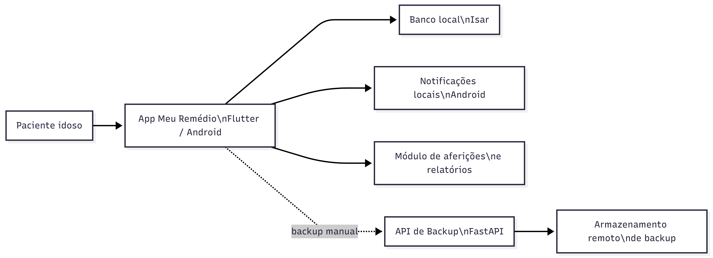
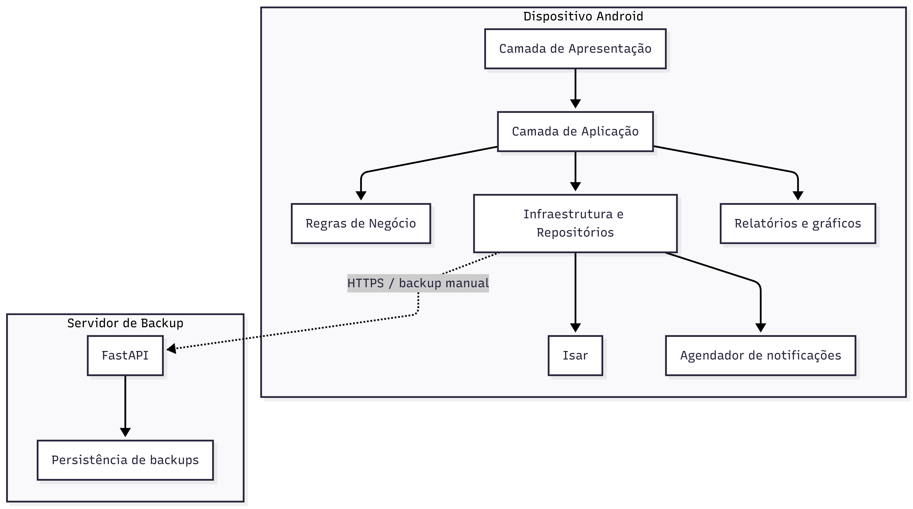
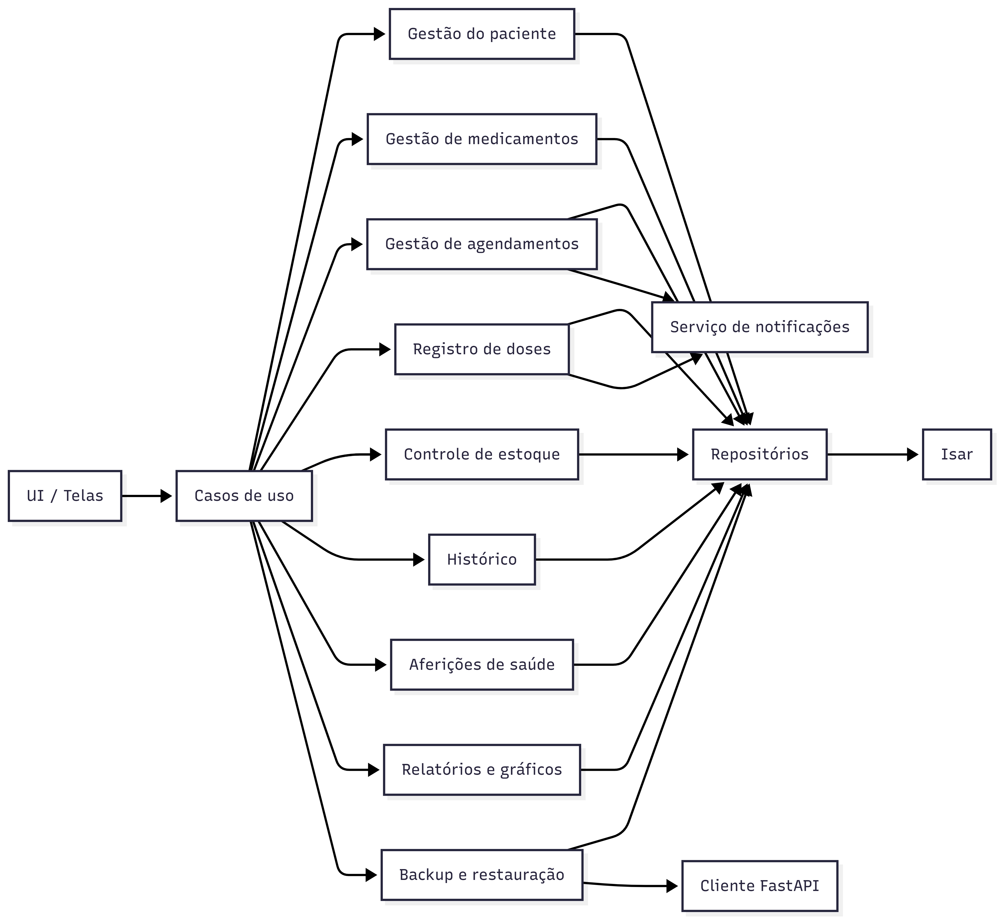
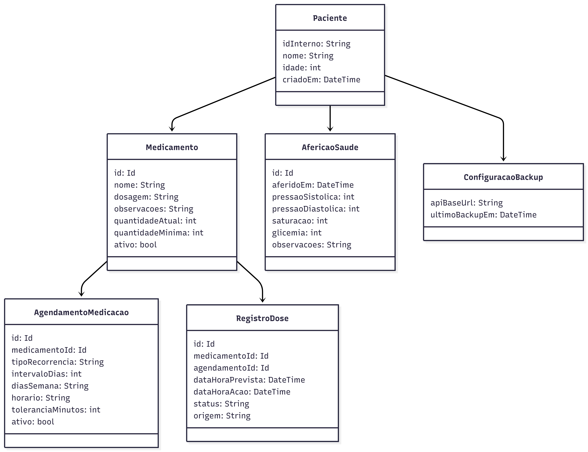
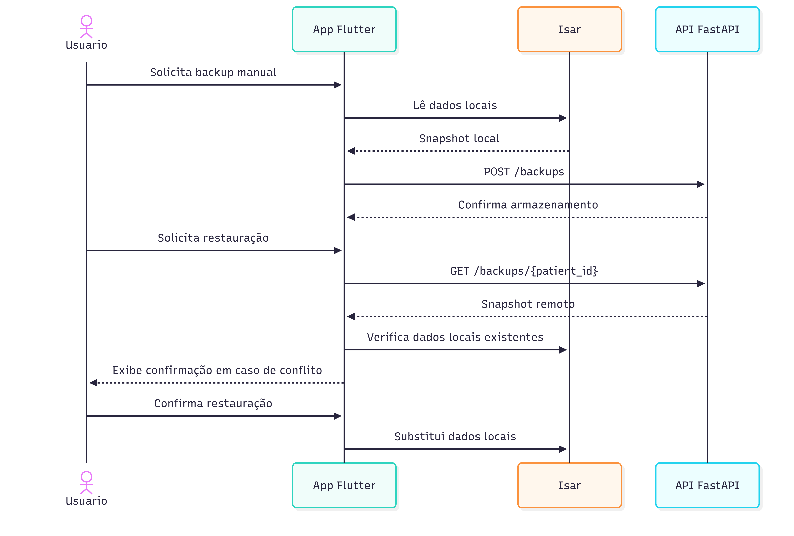

# Documento de Arquitetura do Sistema

## 1. Visão Geral

### 1.1 Objetivo
Definir a arquitetura do sistema **Meu Remédio / MedControl**, um aplicativo mobile focado em **Android**, desenvolvido em **Flutter**, com operação **offline-first** para auxiliar pacientes idosos no controle da ingestão de medicamentos e no acompanhamento de aferições de saúde.

### 1.2 Problema
Pacientes idosos podem esquecer horários, repetir doses por dúvida sobre a medicação já tomada e ter dificuldade em usar aplicativos complexos. O sistema deve reduzir esses riscos com interface simples, lembretes confiáveis, histórico consultável e acompanhamento de indicadores de saúde.

### 1.3 Escopo Arquitetural
Este documento cobre:

- arquitetura do aplicativo mobile
- arquitetura da API de backup
- persistência local e remota
- sincronização manual e restauração
- requisitos arquiteturalmente relevantes
- diagramas de visão geral, componentes, dados e sequência

## 2. Direcionadores Arquiteturais

### 2.1 Público-alvo
- paciente idoso
- usuário único por instalação
- sem perfis de cuidador ou administrador na versão atual

### 2.2 Requisitos Funcionais Relevantes
- cadastro básico do paciente com nome e idade
- geração automática de identificador interno do paciente
- cadastro de medicamentos
- agendamento recorrente de medicação
- recorrência diária, semanal ou a cada `x` dias
- suporte a múltiplos agendamentos para o mesmo medicamento no mesmo dia
- emissão de notificações locais
- confirmação de dose tomada
- adiamento de medicação
- repetição do alerta até confirmação
- histórico com filtros
- controle de estoque
- alerta de estoque baixo
- cadastro de aferições de saúde
- registro individual ou conjunto de pressão, saturação e glicemia
- relatórios de aferições por período
- gráficos de evolução das aferições
- backup manual
- restauração de backup

### 2.3 Requisitos Não Funcionais Relevantes
- funcionamento offline
- interface simples para idosos
- botões grandes, textos legíveis e alto contraste
- confiabilidade dos alertas
- baixo acoplamento entre interface, regras e persistência
- foco em simplicidade operacional

### 2.4 Restrições e Premissas
- plataforma foco: Android
- tecnologia do app: Flutter
- banco local: Isar
- API de backup: FastAPI
- sincronização apenas manual
- sem autenticação tradicional
- sem multiusuário
- sem requisitos adicionais de criptografia além do uso recomendado de HTTPS

## 3. Decisões Arquiteturais

| Decisão | Definição | Motivação |
|---|---|---|
| Estilo principal | Offline-first | Garantir uso sem internet |
| Plataforma cliente | Flutter para Android | Reuso, produtividade e foco mobile |
| Persistência local | Isar | Banco não relacional embarcado, rápido e adequado ao cenário local |
| Integração remota | FastAPI | API simples para backup e restauração |
| Identificação do paciente | ID interno gerado pelo app | Evitar ambiguidade de nome e manter simplicidade |
| Sincronização | Manual | Reduz complexidade e dá controle ao usuário |
| Resolução de conflito | Confirmação do usuário | Evita sobrescrita silenciosa |
| Escopo do backend | Apenas backup/restauração | Manter backend enxuto |
| Modelagem de IDs | `idInterno` textual e IDs locais `Id` | Compatibilizar backup estável com modelagem nativa do Isar |
| Modelo de recorrência | diária, semanal ou a cada `x` dias, com múltiplos agendamentos no mesmo dia | Cobrir uso contínuo real de medicamentos |

## 4. Visão Arquitetural

O sistema é composto por um **aplicativo mobile** executado localmente no dispositivo Android e por uma **API remota** responsável exclusivamente por armazenar e devolver backups. O aplicativo mantém sua base principal no dispositivo e não depende de conectividade para operar no dia a dia.

### 4.1 Diagrama de Contexto

### 4.2 Diagrama de Contêineres

## 5. Arquitetura do Aplicativo Mobile

O aplicativo deve ser organizado em camadas para separar interface, regras de negócio e infraestrutura.

### 5.1 Camadas
- **Apresentação**: telas, navegação, componentes visuais e interação com o usuário.
- **Aplicação**: orquestra casos de uso como cadastrar medicamento, registrar dose, gerar backup, restaurar dados, registrar aferições e montar relatórios.
- **Domínio**: entidades e regras de negócio centrais.
- **Infraestrutura**: acesso ao Isar, notificações locais e comunicação HTTP com a API.

### 5.2 Componentes Principais

### 5.3 Responsabilidades
- manter todos os dados operacionais localmente
- gerar alarmes recorrentes com recorrência diária, semanal ou a cada `x` dias
- suportar múltiplos agendamentos independentes para o mesmo medicamento no mesmo dia
- permitir adiar o alarme repetidamente até a confirmação da dose
- baixar estoque automaticamente a cada dose confirmada
- alertar quando o estoque atingir ou ficar abaixo do mínimo
- permitir consulta de histórico por período, medicamento e status
- registrar aferições de pressão, saturação e glicemia em um único lançamento ou separadamente
- gerar relatórios e gráficos de evolução das aferições
- permitir configuração do endereço da API de backup

## 6. Arquitetura da API

O backend possui responsabilidade restrita a **backup** e **restauração**. Ele não participa da rotina diária de notificações, cadastro ou histórico operacional do paciente.

### 6.1 Responsabilidades
- receber snapshot de backup enviado manualmente pelo app
- armazenar backup associado ao identificador interno do paciente
- devolver backup para processo de restauração
- informar metadados básicos do backup, como data da última atualização

### 6.2 Endpoints de Referência
- `POST /backups` para envio de backup
- `GET /backups/{patient_id}` para consulta/recuperação
- `GET /backups/{patient_id}/metadata` para dados resumidos do último backup

### 6.3 Regras
- o backend não altera dados de negócio
- o backup representa uma cópia dos dados do dispositivo
- conflitos entre dados locais e remotos são resolvidos no app com confirmação do usuário

## 7. Persistência e Modelo de Dados

### 7.1 Estratégia
A base principal é local, usando **Isar**. O backup remoto armazena um snapshot lógico dos dados necessários para restauração.

### 7.2 Entidades Principais
- `Paciente`
- `Medicamento`
- `AgendamentoMedicacao`

- `RegistroDose`
- `AfericaoSaude`
- `ConfiguracaoBackup`

### 7.3 Modelo de Dados Simplificado

### 7.4 Regras de Dados
- cada instalação possui um único paciente
- o `idInterno` é gerado automaticamente no primeiro uso
- o `idInterno` do paciente é textual para permitir identificação estável no backup
- as entidades locais persistidas no Isar usam `Id` numérico
- cada medicamento pode ter um ou mais agendamentos ativos
- cada agendamento define a recorrência como diária, semanal ou a cada `x` dias
- o mesmo medicamento pode possuir múltiplos agendamentos independentes no mesmo dia
- cada ocorrência de dose gera um registro histórico
- o alarme dispara no horário previsto e pode ser adiado até confirmação
- ao confirmar dose, o estoque do medicamento é decrementado automaticamente
- uma aferição pode registrar pressão, saturação, glicemia ou qualquer combinação desses valores

## 8. Backup, Restauração e Conflitos

### 8.1 Fluxo de Backup
- o usuário informa o endereço da API
- o app consolida os dados locais
- o app envia o snapshot para a API
- a API armazena o backup por `idInterno`

### 8.2 Fluxo de Restauração
- o usuário solicita restauração
- o app consulta a API pelo `idInterno`
- se houver dados locais e remotos divergentes, o sistema apresenta comparação resumida
- a restauração só prossegue após confirmação do usuário

### 8.3 Diagrama de Sequência

## 9. Estratégia de Notificações

- notificações locais no Android
- disparo com base em agendamento recorrente diário, semanal ou a cada `x` dias
- suporte a múltiplos agendamentos para o mesmo medicamento no mesmo dia
- possibilidade de adiar medicação
- repetição do alerta até confirmação da dose
- atualização da próxima ocorrência após confirmação
- atualização de histórico e estoque após confirmação

## 10. Histórico, Aferições e Consultas

O histórico de medicações deve permitir:

- filtro por período
- filtro por medicamento
- filtro por status da dose

Status previstos:

- `tomada`
- `adiada`
- `nao_confirmada`

O módulo de aferições deve permitir:

- registrar apenas pressão
- registrar apenas saturação
- registrar apenas glicemia
- registrar os três indicadores no mesmo lançamento
- consultar aferições por período
- emitir relatórios resumidos
- apresentar gráficos de evolução por indicador

## 11. Segurança e Privacidade

Por decisão do projeto:

- não haverá autenticação tradicional
- o sistema opera em dispositivo pessoal do paciente
- o identificador interno é técnico, não um mecanismo de autenticação

Medidas mínimas recomendadas:

- uso de `HTTPS` na comunicação com a API
- validação de payload no backend
- tratamento de erro para evitar corrupção de backup

## 12. Riscos Arquiteturais

- falhas de notificação causadas por restrições do sistema Android
- perda de dados caso o usuário não execute backup manualmente
- conflito entre dados locais e remotos durante restauração
- erro de configuração do endereço da API
- crescimento desordenado do histórico sem política futura de retenção

